#  Shine — AI Micro-Drama Video Studio

<p align="center">
  <strong>Next-Generation End-to-End AI Micro-Drama Creation Platform</strong><br>
  Transform prompts into viral vertical video dramas (9:16) with scriptwriting agents, character consistency, neural voice acting, dynamic kinetic captions, multi-language dubbing, and a professional multi-track WebGL editor.
</p>

<p align="center">
  <a href="#-overview">Overview</a> •
  <a href="#-application-preview">Screenshots</a> •
  <a href="#-key-features">Features</a> •
  <a href="#-architecture--tech-stack">Tech Stack</a> •
  <a href="#-cloud-run-serverless-ecosystem">Cloud Run Deployment</a> •
  <a href="#-pipeline-workflow-b1--b9">Pipeline</a> •
  <a href="#-getting-started">Getting Started</a> •
  <a href="#-environment-variables">Configuration</a> •
  <a href="#-project-structure">Project Structure</a> •
  <a href="#-license">License</a>
</p>

---

## 🌟 Overview

**Shine** is a vertical short-form video creation suite engineered specifically for the explosive micro-drama format (TikTok, YouTube Shorts, Instagram Reels, Kuaishou). It unifies AI generative pipelines with a non-linear multi-track timeline editor powered by **Pixi.js** and the **OpenVideo Engine**, enabling creators to produce multi-episode series in minutes.

---

## 📸 Application Preview

<div align="center">
  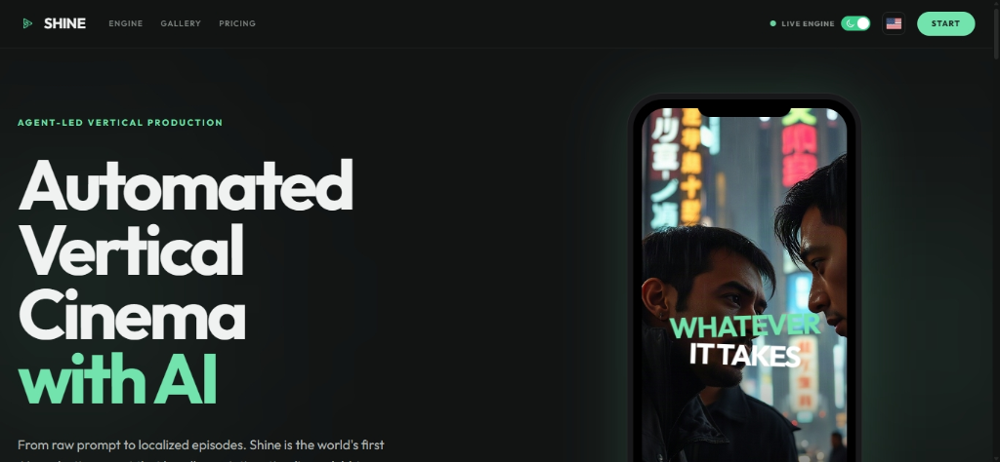
  <p><em>Shine Studio — Next-Generation Automated Vertical Cinema with AI</em></p>
</div>

<br/>

### 1. Studio Hub & Viral Discovery

| **Creator Studio Dashboard** | **Viral Topic Trends & Inspiration** |
| :---: | :---: |
| 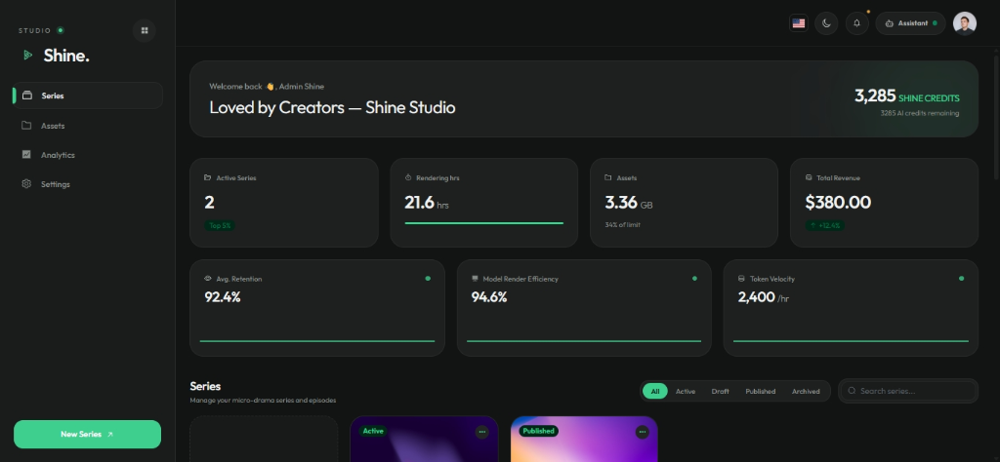 | 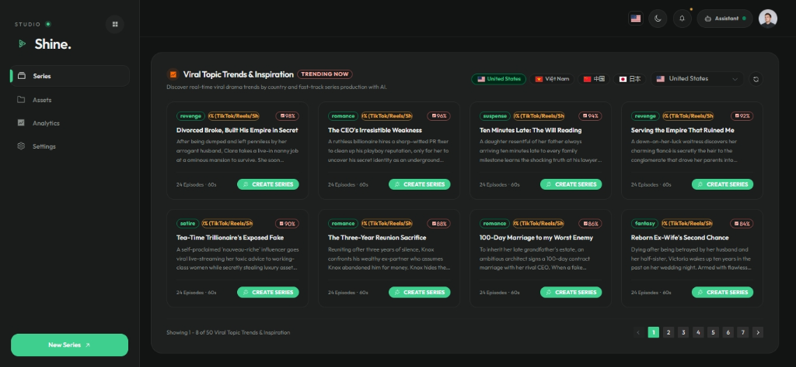 |
| *Real-time series analytics, GPU render velocity, active series monitoring, and creator revenue tracking.* | *AI discovery of trending micro-drama tropes across global markets (US, VN, CN, JP) with 1-click series generation.* |

| **Unified Multi-Modal Asset Library** | **Sign In & Onboarding** |
| :---: | :---: |
| 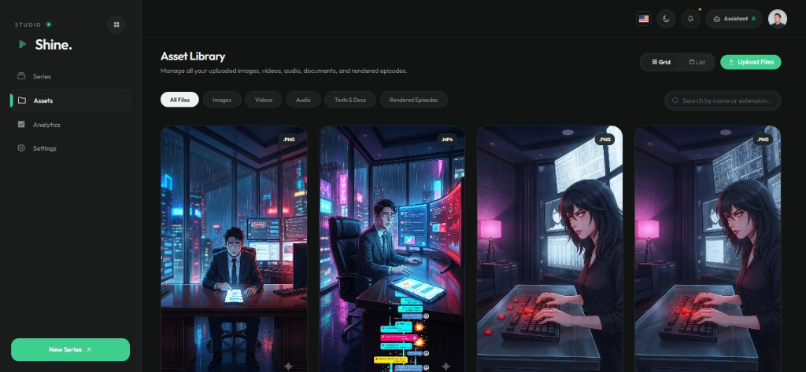 | 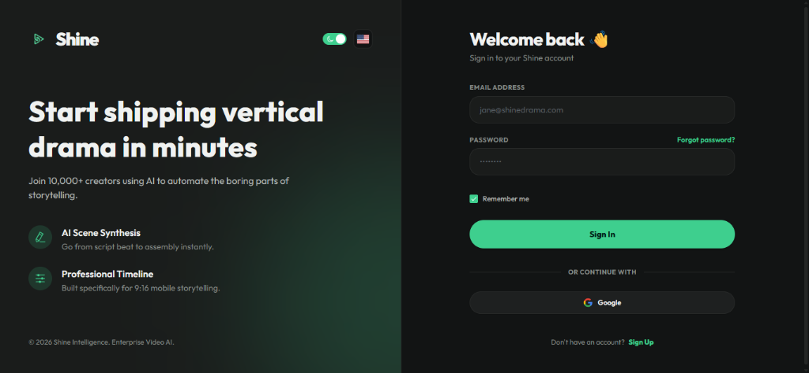 |
| *Centralized multi-modal asset manager for AI-generated images, 9:16 videos, voice tracks, and rendered episodes.* | *Streamlined creator authentication with enterprise-grade security and fast workspace onboarding.* |

### 2. AI Series Creation Wizard: Launch, Genres & Visual Styles

| **Step 1: Launch Mode & Global Market Trends** | **Step 2: Genre Archetypes & 32+ Visual Styles** |
| :---: | :---: |
| 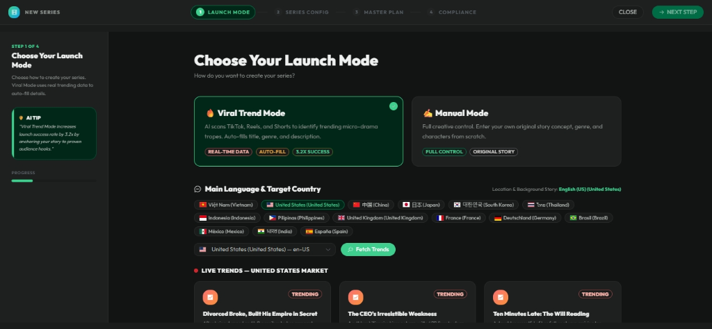 | 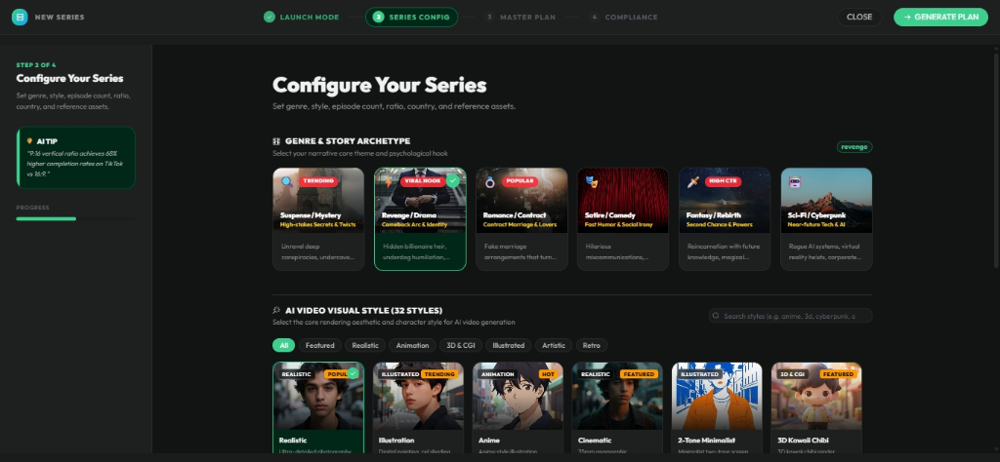 |
| *Viral Trend Mode (AI trend scraper across US, VN, CN, JP) vs Manual Mode with custom hooks.* | *6 psychological story archetypes (Revenge, Romance, Suspense, Sci-Fi) and 32+ AI video visual rendering styles.* |

| **Step 2: Series Configuration & Aspect Ratios** | **Step 3: AI Master Plan Overview** |
| :---: | :---: |
| 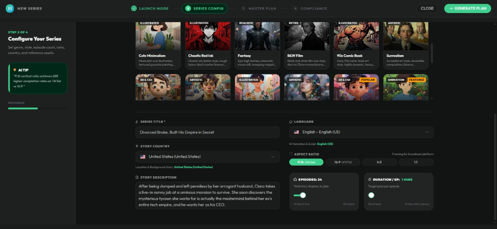 | 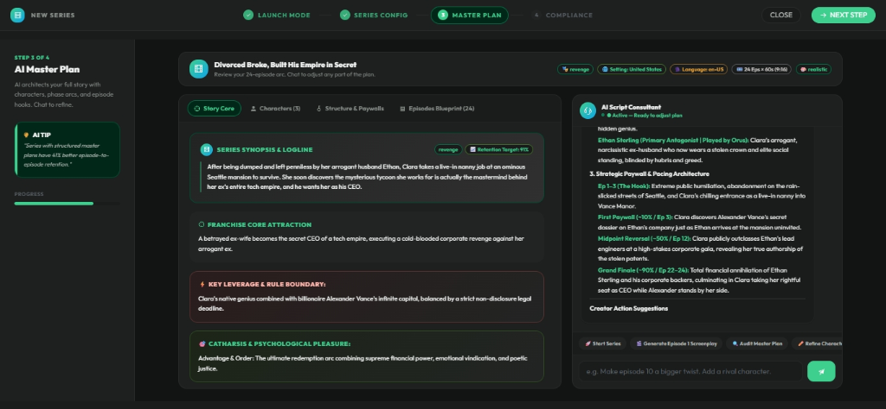 |
| *Full series parameter setup: 9:16 vertical / 16:9 cinematic, target duration, 10–100 episode pacing.* | *Full 24-episode arc generation with Franchise Core, Psychological Catharsis, Paywall Architecture, and conversational AI Script Consultant.* |

### 3. Master Script Breakdown: Characters, 3-Act Structure & Episodes

| **Consistent Cast & Persona DNA** | **Three-Act Structure & Climaxes** |
| :---: | :---: |
| 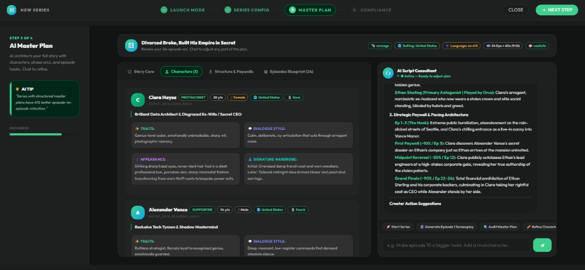 | 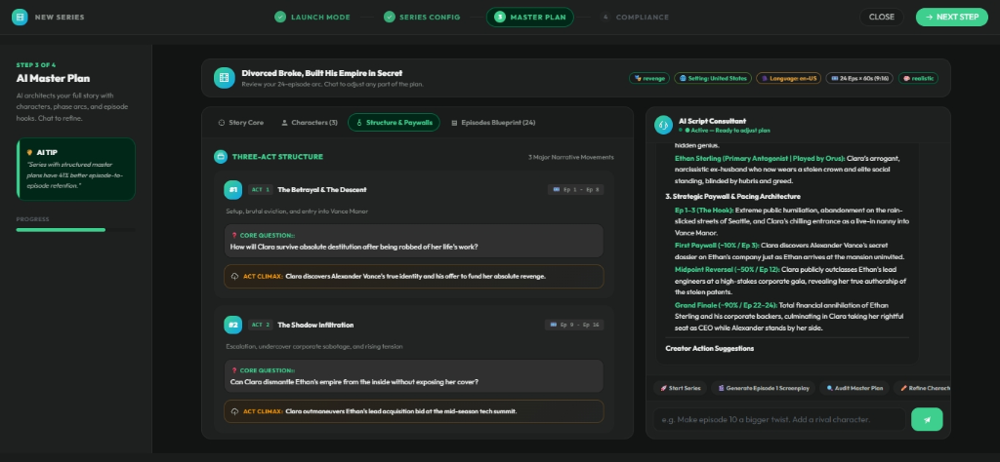 |
| *Granular character identity definitions: personality traits, dialogue styles, signature wardrobe, and LoRA visual continuity anchors.* | *3-Act narrative movements with core thematic questions, conflict escalation, and act-level climax design.* |

<br/>

<div align="center">
  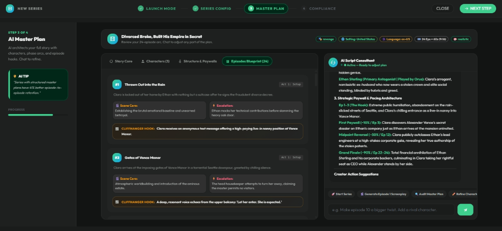
  <p><em>Granular 24-Episode Production Blueprint: Scene Core, Conflict Escalation, and High-Retention Cliffhanger Hooks</em></p>
</div>

### 4. AI Safety, Commercial Compliance & Regulatory Grounding

| **Multi-Dimensional Safety Scan (95% Score)** | **Parallel MCP Grounding & Censorship Redlines** |
| :---: | :---: |
| 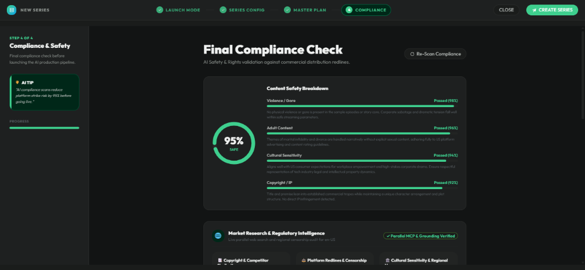 | 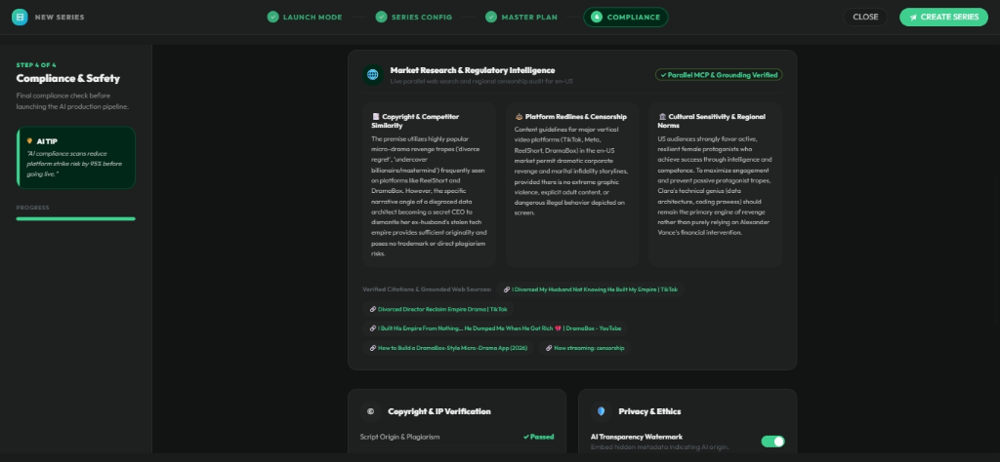 |
| *Automated pre-production compliance check: Violence/Gore (98%), Adult Content (96%), Cultural Sensitivity (94%), and IP Rights (92%).* | *Live web search grounding via Parallel MCP for competitor similarity, regional platform censorship redlines, and IP verification.* |

### 5. Multi-Track WebGL Timeline & AI Agent Studio Editor

| **WebGL Timeline & Shine Agent Assistant** | **Live Trend Engine & Auto-Gen Sequence** |
| :---: | :---: |
| 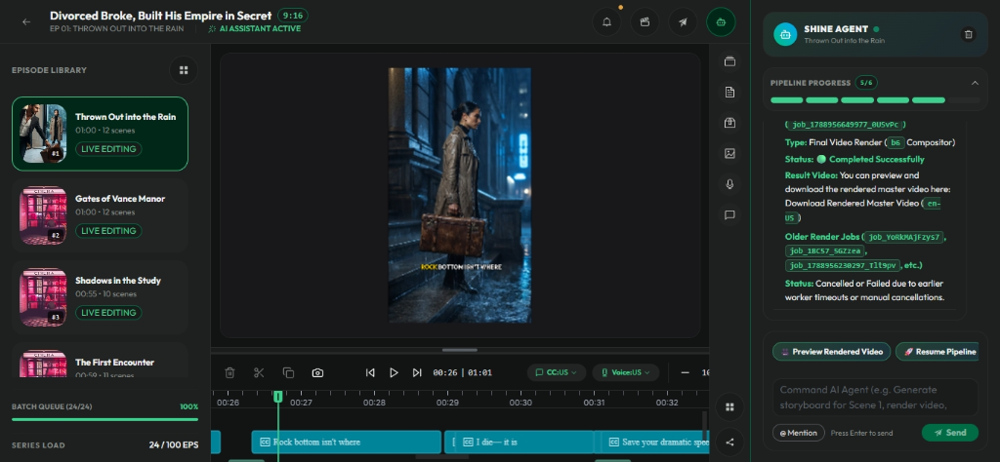 | 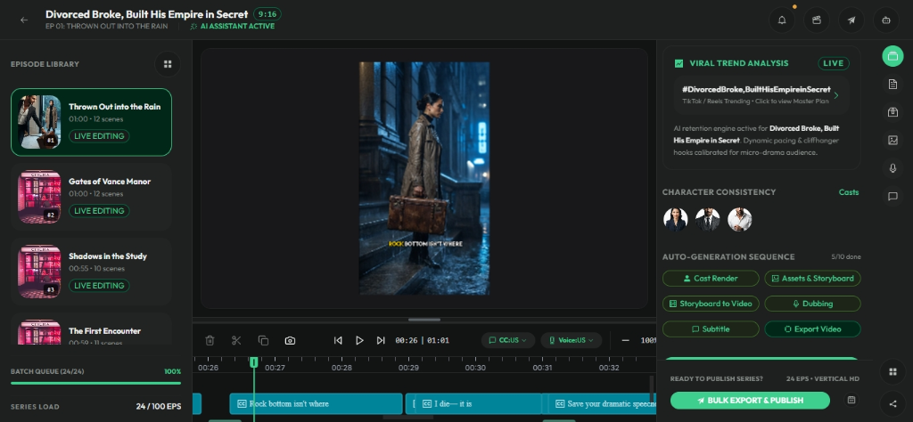 |
| *Real-time 9:16 vertical canvas powered by Pixi.js, kinetic subtitle tracks, Shine Agent conversational commands, and Cloud Run compositor progress.* | *Live viral trend tracking, 24-episode batch queue, and 6-stage auto-generation pipeline (Cast, Storyboard, Image2Video, Dubbing, Subtitles, Export).* |

| **Screenplay Editor & Dialogue Beats** | **Cast Consistency & Wardrobe Switcher** |
| :---: | :---: |
| 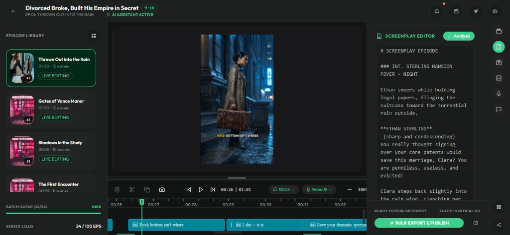 | 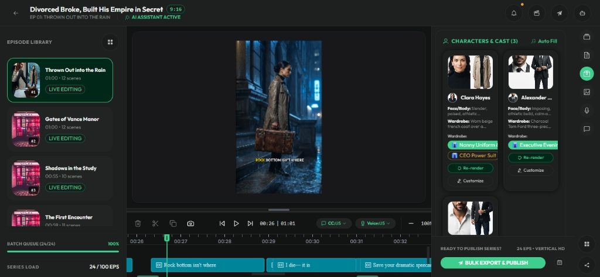 |
| *Integrated screenplay editor with slugline breakdown, character dialogue formatting, emotional parentheticals, and direct AI analysis.* | *Cast identity management with multi-wardrobe presets (e.g. Nanny Uniform vs CEO Power Suit) maintaining visual facial consistency.* |

<br/>

<div align="center">
  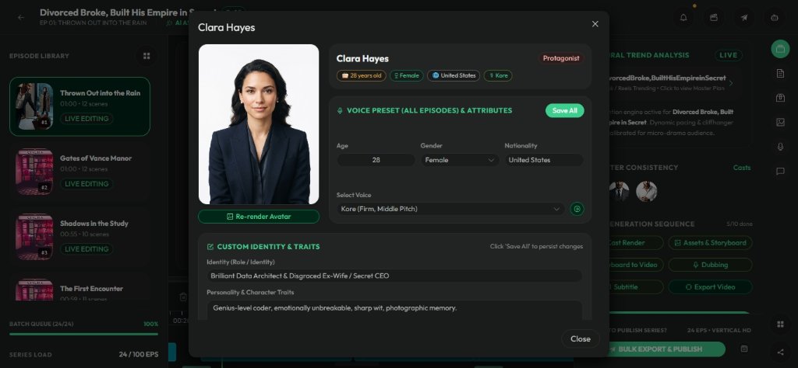
  <p><em>Character Persona Modal: Real-time Avatar Re-rendering, LoRA Prompt Anchors, and Neural Voice Preset Assignment</em></p>
</div>

### 6. Asset & Generation Pipeline: Storyboards, Sets, Dubbing & Subtitles

| **Storyboard Scene Breakdown & AI Video** | **Sets, Locations & Key Props Engine** |
| :---: | :---: |
| 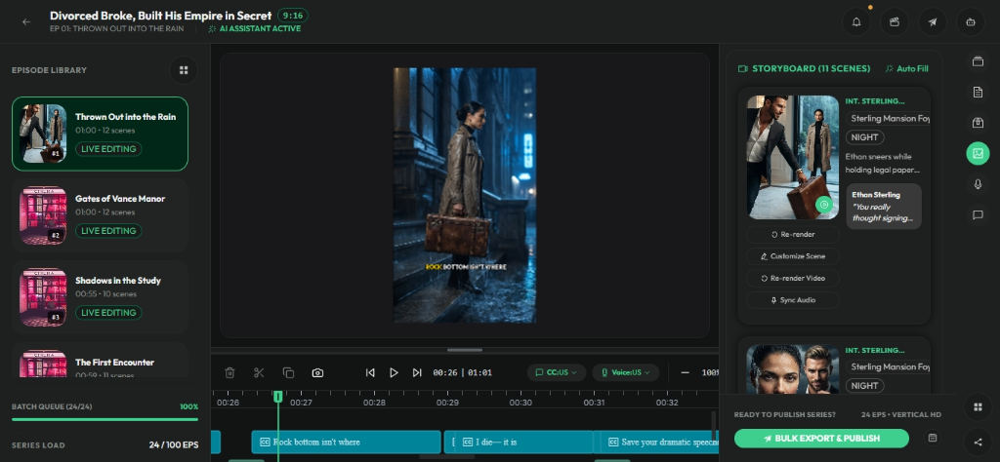 | 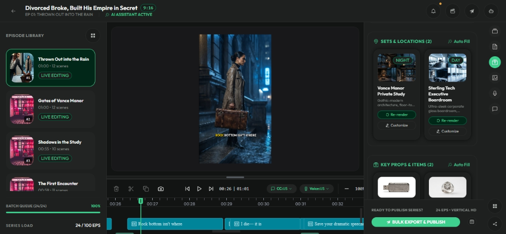 |
| *11-scene visual storyboard with 1-click scene regeneration, camera motion prompts, video synthesis, and audio sync.* | *Persistent virtual sets (e.g. Vance Manor Study, Boardroom) and key storyline props (Encrypted USB, Platinum Ring).* |

| **Neural Character Voices & AI Dubbing** | **Dynamic Kinetic Subtitles & Translation** |
| :---: | :---: |
| 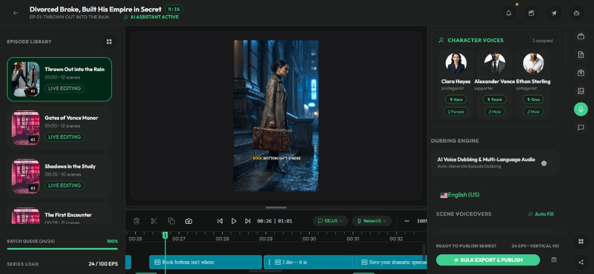 | 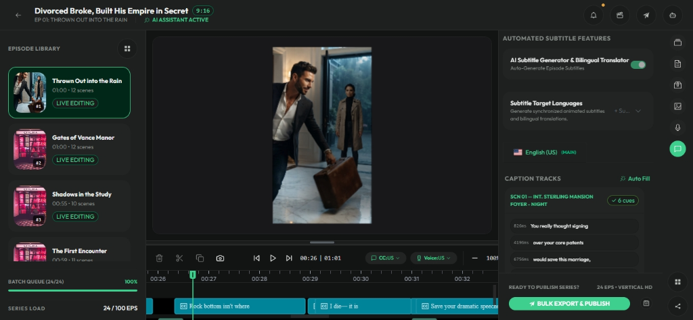 |
| *Assigned multi-speaker voices (Clara [Kore], Alexander [Fenrir], Ethan [Orus]) and automated multi-language dubbing.* | *Auto-generated word-level kinetic subtitles, viral highlight animations, and bilingual subtitle translation.* |

<br/>

<div align="center">
  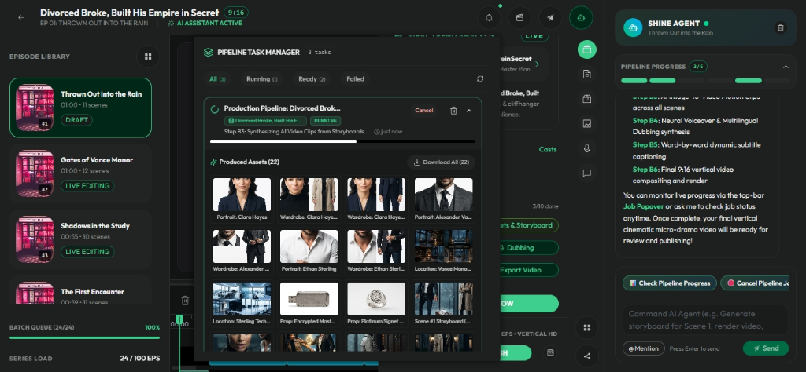
  <p><em>Pipeline Task Manager: Asynchronous Step B3–B6 Execution & 22 Produced Multi-Modal Assets Repository</em></p>
</div>

### 7. Dual-Mode Video Export & Review Player

| **Export Settings: Multi-Resolution & Social Formats** | **Client-Side WebCodecs Video Compositing** |
| :---: | :---: |
| 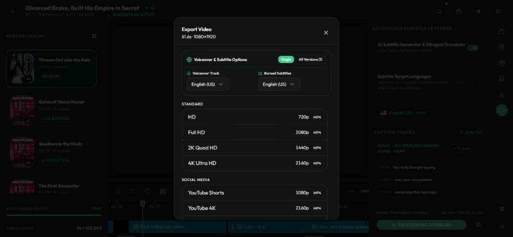 | 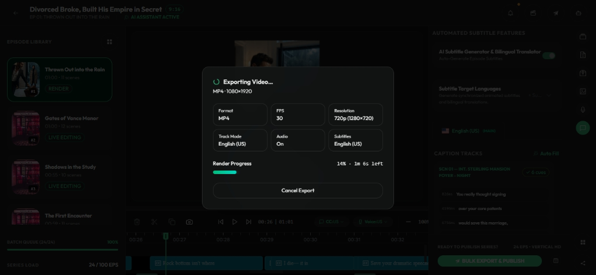 |
| *Granular export configurations: HD 720p to 4K Ultra HD, dedicated YouTube Shorts presets, and audio/burned-in subtitle track selection.* | *High-speed, zero-server-cost browser video rendering powered by WebCodecs, featuring live frame-by-frame progress and ETA countdown.* |

<br/>

<div align="center">
  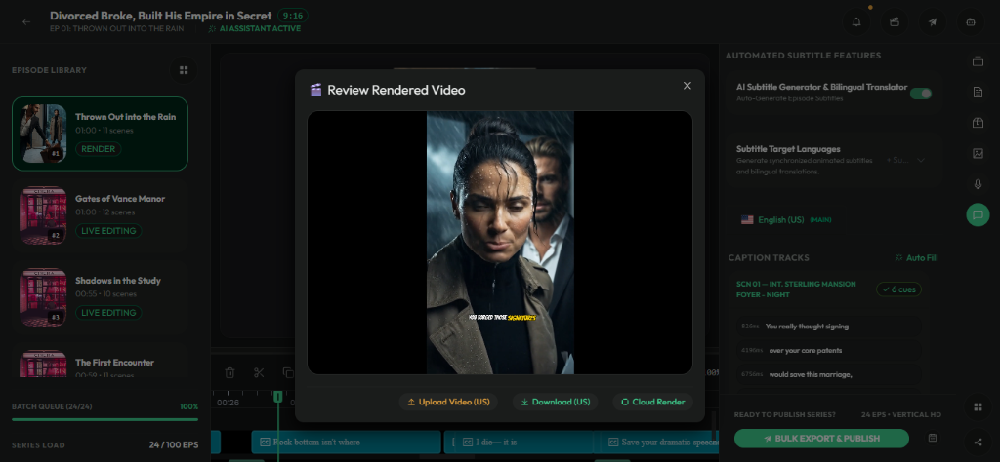
  <p><em>Post-Render Review Player: Integrated Preview with Burned Kinetic Captions, 1-Click Download, and Direct Cloud Video Storage Upload</em></p>
</div>

### 8. Bulk Export & Multi-Platform Social Publishing Center (B9)

| **Step 1: Available Rendered Versions** | **Step 2: AI Viral Metadata & Poster Cover** |
| :---: | :---: |
| 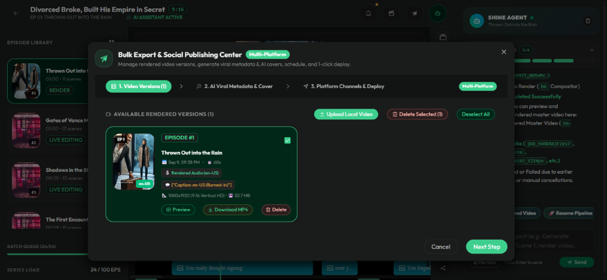 | 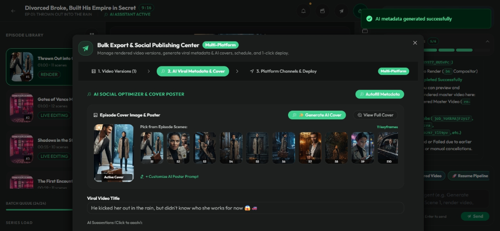 |
| *Selection of rendered 9:16 vertical episodes, audio track modes, burned-in subtitles, and local video upload triggers.* | *AI social optimizer: keyframe-based poster generation, viral hook titles with emojis, and automated hashtag metadata injection.* |

| **Step 3: Channels & 1-Click Multi-Deploy** | **Live Deployment Confirmation** |
| :---: | :---: |
| 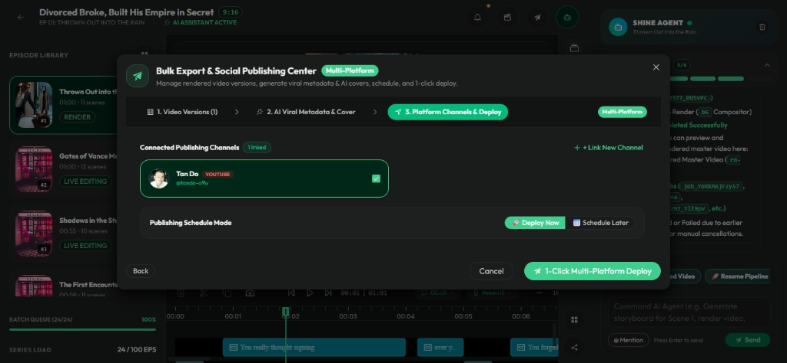 | 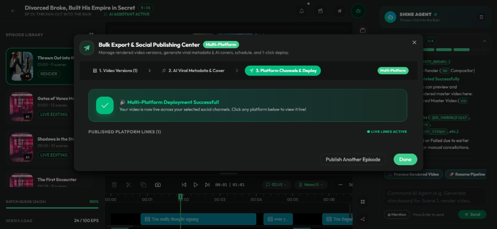 |
| *Connected channel routing (YouTube, TikTok, Reels), scheduling options (Deploy Now / Schedule Later), and 1-click publishing.* | *Instant deployment verification with live social platform viewing links and direct episode status confirmation.* |

| **Publishing Task Manager Activity Logs** | **Live YouTube Shorts Playback** |
| :---: | :---: |
| 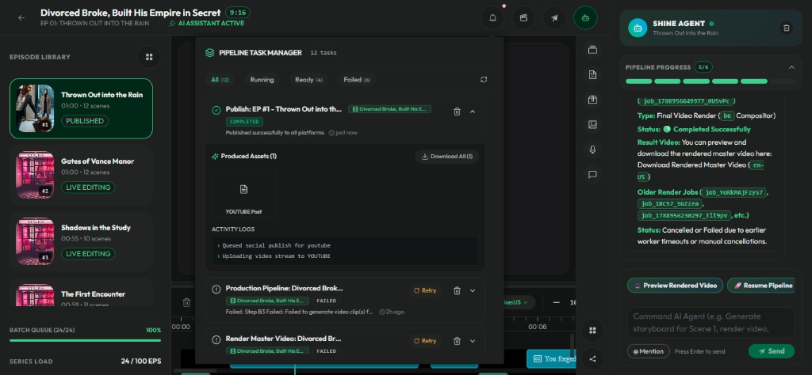 | 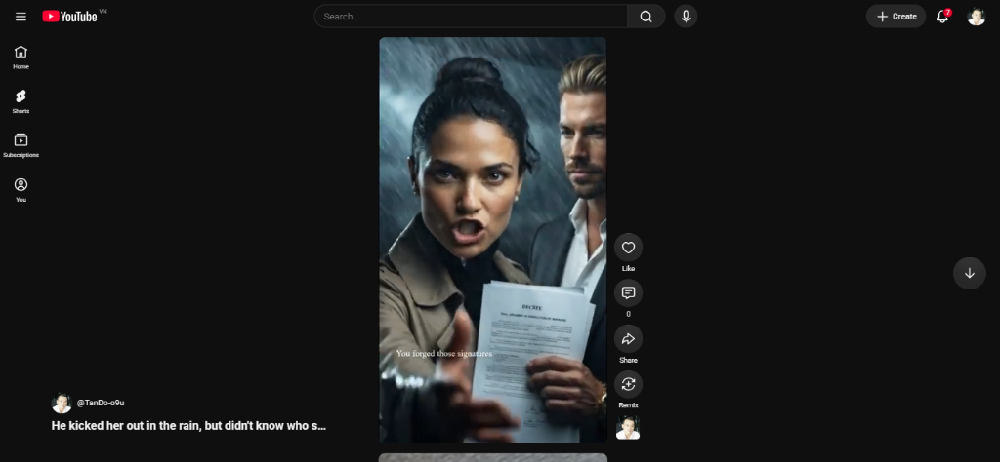 |
| *Pipeline Task Manager: Asynchronous video upload stream logs and social asset registration.* | *Live verified playback on YouTube Shorts: vertical 9:16 format with burned dynamic kinetic subtitles.* |

### 9. Deep Episode Analytics & AI Script Evolution

| **Retention Insights & Demographic Split** | **Engagement Heatmap & Screenplay Directives** |
| :---: | :---: |
| 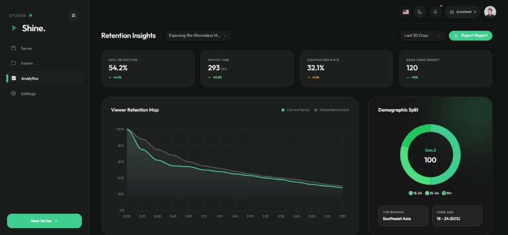 | 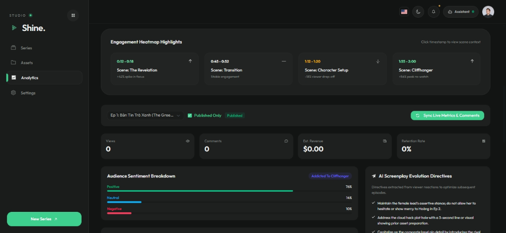 |
| *Second-by-second viewer retention curve, global benchmark comparison, watch time, and Gen-Z demographic split.* | *Scene-level engagement spikes, drop-off markers, audience sentiment, and AI screenplay evolution directives for next episodes.* |

<br/>

<div align="center">
  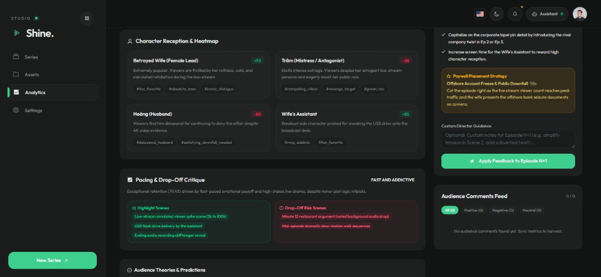
  <p><em>Character Reception Heatmap, Pacing & Drop-off Critique, Paywall Placement Strategy, and Director Feedback Loop (Episode N+1)</em></p>
</div>

### 10. AI Pipeline Engine & Model Orchestration

| **API & AI Pipeline Models Configuration** | **Task Credits & Stock Media Integrations** |
| :---: | :---: |
| 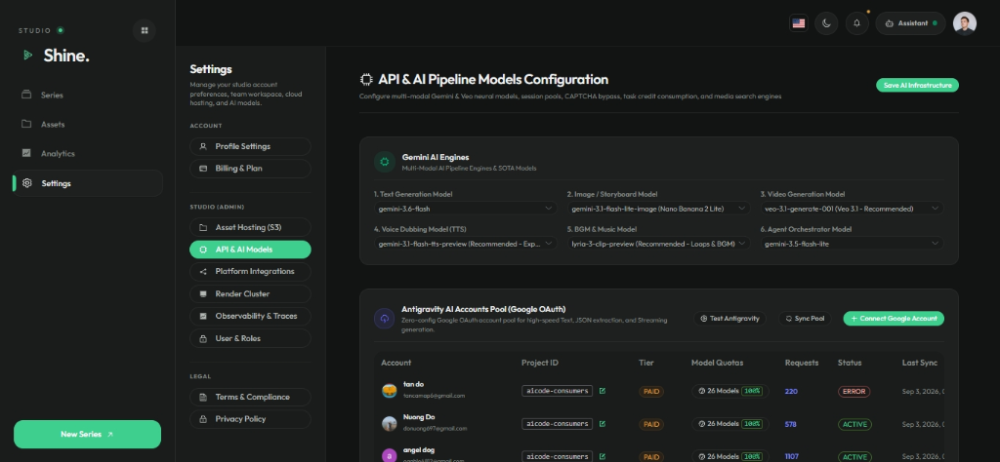 | 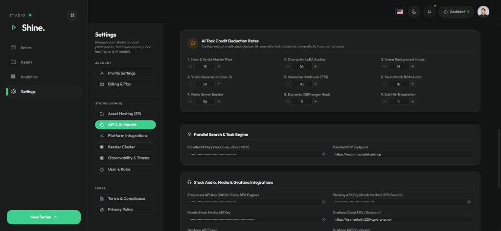 |
| *Multi-modal engine routing (Gemini 3.5, Veo 3.1, Lyria) with Antigravity Google OAuth account pooling for resilient token throughput.* | *Granular AI task credit consumption rules, Parallel search MCP endpoint, and stock media engine keys (Freesound, Pixabay, Pexels).* |

### 11. Cloud Infrastructure, Observability & Studio Administration

| **Serverless Render Cluster Telemetry** | **Grafana Observability & Subagent Traces** |
| :---: | :---: |
| 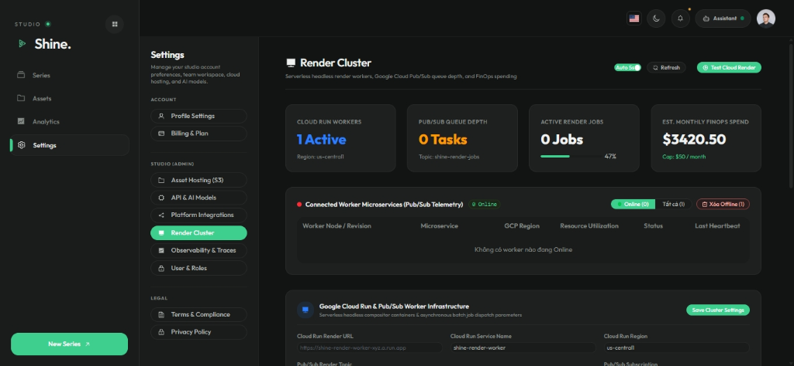 | 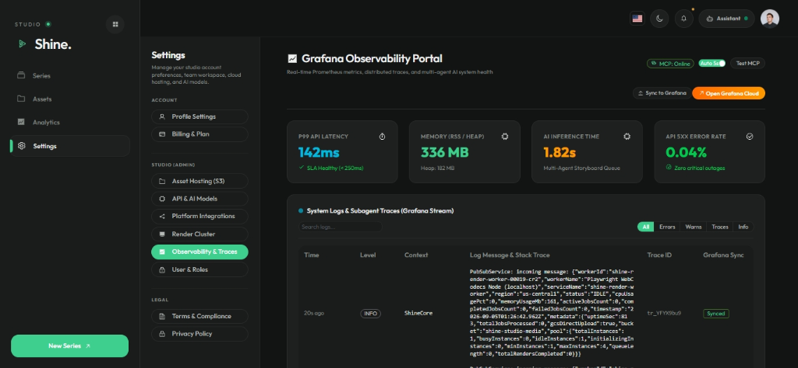 |
| *Cloud Run worker health, Pub/Sub render queue depth, FinOps spending tracker, and real-time compositor telemetry.* | *Real-time Prometheus metrics, P99 API latency (142ms), AI inference timers, and live subagent execution logs.* |

| **Multi-Channel Video Publishing & SSO** | **User Management & Role Permissions** |
| :---: | :---: |
| 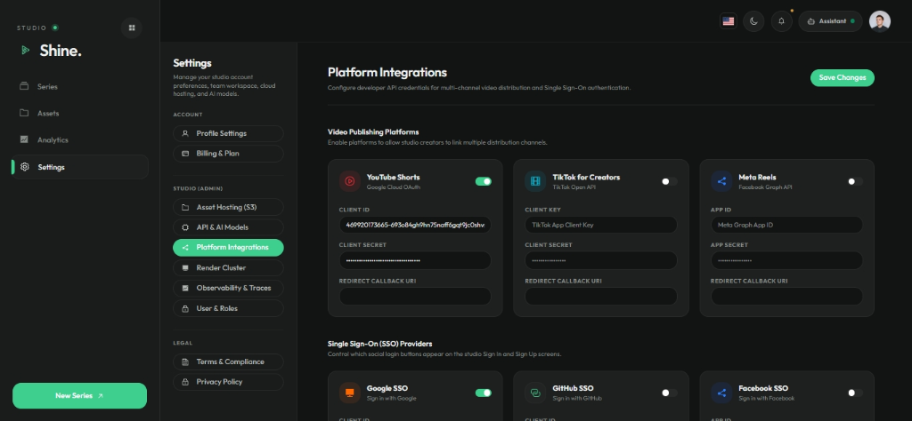 | 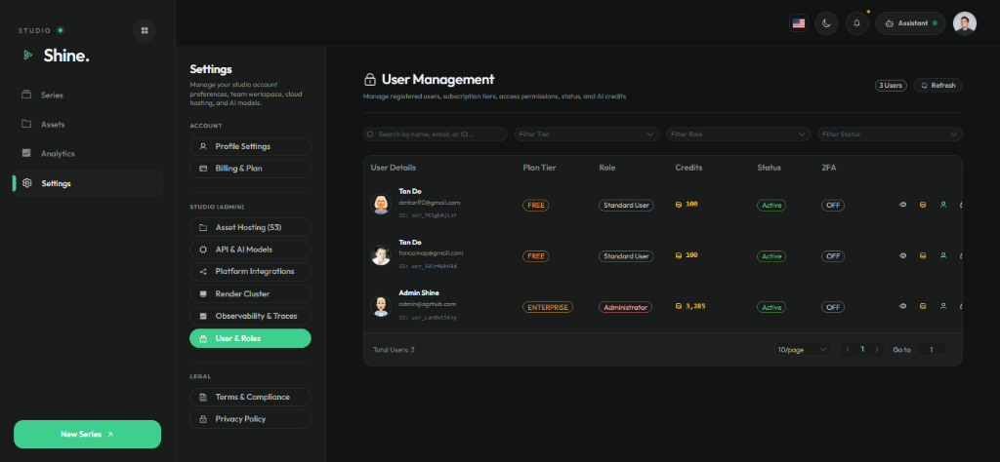 |
| *Direct OAuth publishing triggers for YouTube Shorts, TikTok for Creators, Meta Reels, and enterprise SSO providers.* | *Multi-tenant user administration, 2FA security, role-based access control (Admin / Standard), and credit quota allocations.* |

| **Creator Profile & Channel Connections** | **Billing & Subscription Plans** |
| :---: | :---: |
| 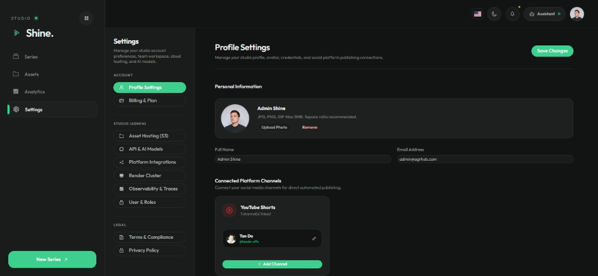 | 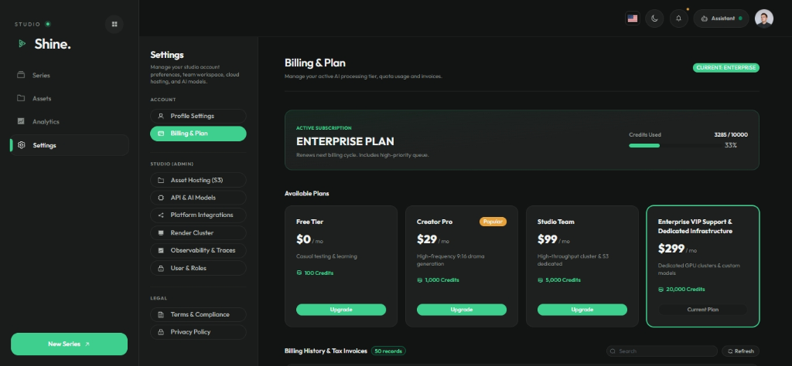 |
| *Studio creator profile settings, avatar, credentials, and social media distribution account mapping.* | *Transparent AI token credit quotas, high-priority GPU render queues, and tier management (Free to Enterprise VIP).* |

---

## ✨ Key Features

### 🎭 1. AI Director & Master Scriptwriting
- **Automated Series Architect**: Generate complete 10–50 episode drama arcs with cliffhangers, conflict escalation, and character backstory.
- **Scene-by-Scene Breakdown**: Generates precise scene headers, actions, visual descriptions, camera instructions, and character dialogues.

### 👥 2. Character Consistency & Persona Engine
- **Visual Identity Preservation**: Generates character reference sheets and avatars for consistent appearances across episodes.
- **LoRA / Prompt DNA**: Automatic prompt injection ensures visual continuity for all cast members.

### 🎙️ 3. Multi-Language Neural Voiceover & Dubbing
- **Multi-Speaker TTS**: Assign distinct AI voices to each character with granular control over intensity, pacing, emotion, and pitch.
- **Multi-Language Tracks**: Create separate voice tracks (`vi-VN`, `en-US`, `zh-CN`, `ja-JP`, `ko-KR`) for global distribution.
- **AI Dubbing Re-alignment**: Automatic syllable density time-expansion adjustment to align dubbed audio with scene visuals.

### 📝 4. Kinetic Subtitles & Translation
- **Word-Level Kinetic Timing**: Auto-generates viral pop-in, bounce, and glowing subtitle animations.
- **One-Click Multi-Language Translation**: AI-powered translation of subtitle cues while preserving micro-drama timing and tone.

### 🎞️ 5. Scene-to-Video Generation
- **Image-to-Video Engine**: Transform storyboard scene backgrounds into cinematic video clips with camera movement (dolly, pan, zoom).
- **Smart Batch Rendering**: Intelligently skips already-rendered assets to optimize generation cost and speed.

### 🎛️ 6. OpenVideo Multi-Track WebGL Timeline
- **Non-Linear Editing**: Video, image, voiceover, BGM, SFX, captions, and transition tracks.
- **Interactive Canvas**: Real-time PIXI-accelerated preview, clip splitting, trimming, layering, and property manipulation.
- **Auto-Ducking & Soundscapes**: Intelligent background music volume ducking during dialogue.

### 🚀 7. Dual-Mode Render & Export (B8)
- **Local In-Browser Render**: Zero-server-cost fast client rendering via WebCodecs (`mediabunny` / `ExportModal`).
- **Cloud Serverless Queue**: Scalable asynchronous rendering via `@openvideo/video-renderer` headless Playwright workers on Google Cloud Run + Pub/Sub, featuring a managed **`VideoRendererPool`** (1–100 instances) with Out of Memory (OOM) protection and browser recycling.
- **Post-Render Review**: In-app video preview player with instant download and direct publishing triggers.

### 🛡️ 8. AI Watermarking & Provenance
- **Google SynthID Integration**: Digital audio/video watermarking.
- **C2PA / Content Credentials**: Cryptographic provenance tracking for AI-generated media authenticity.

### 🏰 9. Sets, Locations & Narrative Props Engine
- **Cross-Scene Environment Consistency**: Define and manage persistent virtual sets (Luxury Penthouse, Neon Alley, Cyberpunk Lab) with locked visual prompt descriptors.
- **Narrative Story Props**: Assign critical storyline props (encrypted flash drive, vintage dagger, platinum ring) to scene visual prompts for seamless physical world continuity.

### 📲 10. Bulk Social Publishing Center (B9)
- **3-Step Publishing Wizard**: Select multiple rendered versions, generate platform-optimized SEO titles, descriptions, and hashtags via Gemini, and dispatch with 1-click.
- **Multi-Platform Distribution**: Automated video deployment to YouTube Shorts, TikTok, Instagram Reels, and Douyin with instant post or scheduled timing.
- **Verified Live Playback**: Live playback verified on YouTube Shorts (`@TanDo-o9u`) with burned dynamic kinetic captions and full vertical 9:16 framing.

### 🔄 11. Antigravity Google OAuth Account Pool
- **High-Throughput Credential Rotation**: Connect and pool multiple Google OAuth accounts to handle high-concurrency script synthesis and video generation.
- **Automated Rate-Limit Failover**: Real-time token health monitoring automatically fails over upon encountering HTTP 429 quotas with zero job drops.

### 📊 12. Enterprise Observability & Grafana Telemetry
- **Subagent Latency & Token Meters**: Real-time OpenTelemetry exporters streaming P95/P99 latency, token usage per subagent, and error rates to Grafana Cloud.
- **FinOps Cluster Health**: Live CPU, memory, and task queue monitoring for Google Cloud Run compositor workers.

---

## 🏗 Architecture & Tech Stack

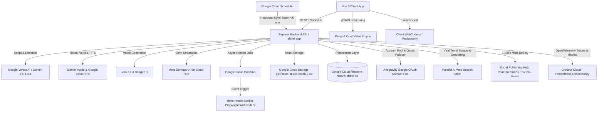
```mermaid
graph TD
    Client[Vue 3 Client App] -->|REST / Socket.io| Server[Express Backend API / shine-app]
    Client -->|WebGL Rendering| PIXI[Pixi.js & OpenVideo Engine]
    Client -->|Local Export| WebCodecs[Client WebCodecs / Mediabunny]

    Server -->|Script & Direction| Gemini[Google Vertex AI / Gemini 3.5 & 3.1]
    Server -->|Neural Voices / TTS| TTS[Gemini Audio & Google Cloud TTS]
    Server -->|Video Generation| VideoAI[Veo 3.1 & Imagen 3]
    Server -->|Stem Separation| Demucs[Meta Demucs v4 on Cloud Run]
    Server -->|Async Render Jobs| PubSub[Google Cloud Pub/Sub]
    PubSub -->|Event Trigger| RenderWorker[shine-render-worker Playwright WebCodecs]
    Server -->|Asset Storage| Storage[Google Cloud Storage gs://shine-studio-media / B2]
    Server -->|Persistence Layer| DB[(Google Cloud Firestore Native: shine-db)]
    Scheduler[Google Cloud Scheduler] -->|Heartbeat Sync Token */5 min| Server

    Server -->|Account Pool & Quota Failover| OAuthPool[Antigravity Google OAuth Account Pool]
    Server -->|Viral Trend Scrape & Grounding| ParallelMCP[Parallel AI Web Search MCP]
    Server -->|1-Click Multi-Deploy| SocialHub[Social Publishing Hub: YouTube Shorts / TikTok / Reels]
    Server -->|OpenTelemetry Traces & Metrics| Grafana[Grafana Cloud / Prometheus Observability]
```

| Layer | Technologies |
|---|---|
| **Frontend Framework** | [Vue 3](https://vuejs.org/) (Composition API, `<script setup>`), [TypeScript](https://www.typescriptlang.org/) |
| **Build Tool** | [Vite 7](https://vitejs.dev/), [pnpm](https://pnpm.io/) |
| **UI & Styling** | [Element Plus](https://element-plus.org/), [TailwindCSS v4](https://tailwindcss.com/), Tabler & Lucide Icons |
| **Video & Canvas Engine** | [`@openvideo/video-renderer`](https://www.npmjs.com/package/@openvideo/video-renderer), `@openvideo/engine-pixi`, `@openvideo/timeline`, [Pixi.js v8](https://pixijs.com/) |
| **State Management** | [Pinia](https://pinia.vuejs.org/), VueUse |
| **Internationalization** | [Vue I18n](https://vue-i18n.intlify.dev/) (EN, VI, ZH, JA, KO, ES, FR) |
| **Backend API** | [Node.js](https://nodejs.org/), [Express](https://expressjs.com/), [Socket.io](https://socket.io/) |
| **Database Providers** | [Google Cloud Firestore](https://cloud.google.com/firestore) Native (`shine-db`), [MongoDB](https://www.mongodb.com/), MapDB, SQLite |
| **Cloud Infrastructure** | **Google Cloud Run** (`us-central1`), **Cloud Pub/Sub**, **Cloud Scheduler**, **Google Cloud Storage** (`gs://shine-studio-media`) |
| **Audio Stem Separation** | [Meta Demucs v4](https://github.com/facebookresearch/demucs) Serverless Microservice on **Google Cloud Run** |
| **Media Processing** | [`@openvideo/video-renderer`](https://www.npmjs.com/package/@openvideo/video-renderer) (Playwright WebCodecs Headless), [FFmpeg](https://ffmpeg.org/) |
| **AI Services** | Google Vertex AI / Gemini 3.5 & 3.1 Flash / Imagen 3 / Veo 3.1 |
| **Real-Time Trend Grounding** | **Parallel AI Web Search MCP** (Multi-platform short-video trend radar) |
| **Observability & FinOps** | **Grafana Cloud**, Prometheus, OpenTelemetry Traces & Metrics |
| **Social Distribution** | YouTube Data API v3 (Shorts), TikTok Open API, Meta Graph API (Reels) |

---

## ☁️ Cloud Run Serverless Ecosystem

The entire backend and processing engine is architected for **Serverless Scale-to-Zero ($0 idle cost)** with automated infrastructure provisioning:

| Microservice | Default Region | Resource Specs | Behavior & Cost Optimization |
|---|---|---|---|
| **`shine-app`** | `us-central1` | 2 vCPU / 2Gi RAM | Main API + Vue SPA (`--min-instances 0`, `--cpu-throttling`). Scales to zero when idle. |
| **`shine-render-worker`** | `us-central1` | 4 vCPU / 8Gi RAM | Headless Chromium + WebCodecs compositor for asynchronous 4K/1080p MP4 exports (`--min-instances 0`). |
| **`demucs-worker`** | `us-central1` | 2 vCPU / 4Gi RAM | Meta Demucs v4 AI worker for vocal/BGM isolation (`--min-instances 0`). |
| **Cloud Scheduler** | `us-central1` | `*/5 * * * *` | Calls `POST /api/admin/flow-accounts/sync` to maintain Google Flow token freshness in Firestore. |

### 🚀 1-Click Complete Ecosystem Deployment

Deploy all 3 Cloud Run services, Cloud Scheduler, Pub/Sub topics, Firestore Database, and GCS Bucket in one command:

```powershell
# Windows PowerShell
.\scripts\deploy-cloudrun.ps1
```

```bash
# Linux / macOS / Cloud Shell
./scripts/deploy-cloudrun.sh
```

**Automated Deployment Steps Handled by Script:**
1. **API Check & Activation**: Auto-checks and enables 10 GCP APIs (`run`, `cloudbuild`, `artifactregistry`, `pubsub`, `firestore`, `datastore`, `cloudscheduler`, `aiplatform`, `storage`, `texttospeech`).
2. **IAM & Security**: Auto-grants `roles/datastore.user`, `roles/pubsub.editor`, `roles/storage.objectAdmin`, and `roles/aiplatform.user` to the Compute Service Account.
3. **Database & Storage**: Auto-creates Firestore Native database `shine-db` and GCS Bucket `gs://shine-studio-media` if missing.
4. **Message Queue**: Auto-creates Pub/Sub topics (`shine-render-jobs`, `shine-render-status`) and subscriptions (`shine-render-sub`, `shine-render-status-sub`).
5. **Full Configuration Injection**: Forwards 100% of `.env` variables via YAML dictionary.
6. **Token Sync Heartbeat**: Automatically sets up Google Cloud Scheduler.

---

## 🔄 Pipeline Workflow (B1 – B9)

```
[B1: Storyboards] ➔ [B2: Characters/Assets] ➔ [B3: Image2Video] ➔ [B4: Multi-Lang Voiceover]
       ➔ [B5: Kinetic Captions] ➔ [B6: WebGL Preview]
              ➔ [B7: Dual Export] ➔ [B8: Auto-Save] ➔ [B9: Multi-Publish]
```

1. **B1: Storyboard Backgrounds** — Generates initial 9:16 scene visual concepts.
2. **B2: Consistent Cast** — Generates and locks character avatars and visual assets.
3. **B3: Scene Image-to-Video** — Converts storyboard scenes into motion video clips.
4. **B4: Neural Voiceover (TTS)** — Synthesizes multi-speaker dialogue per language track.
5. **B5: Kinetic Captions** — Generates word-level animated subtitles with translation capabilities.
6. **B6: Interactive Timeline Preview** — Synchronizes all assets into the OpenVideo canvas editor.
7. **B7: Dual-Mode Export** — Fast local browser render or high-performance server job queue.
8. **B8: Auto-Save & State Sync** — Automatically persists timeline state, scenes, and language tracks.
9. **B9: Multi-Platform Publish** — Prepares and packages exports for TikTok, YouTube Shorts, and Reels.

---

## 🚀 Getting Started

### Prerequisites

- **Node.js**: `v20.x` or higher
- **Package Manager**: `pnpm` (`v9.x` or `v10.x`)
- **Google Cloud SDK (`gcloud`)**: Configured with project authentication

### 1. Clone the Repository

```bash
git clone https://github.com/agrhub/shine.git
cd shine
```

### 2. Install Dependencies

```bash
pnpm install
```

### 3. Setup Environment Variables

Copy the example configuration file:

```bash
cp .env.example .env
```

Edit `.env` with your API credentials (see [Configuration](#-environment-variables) below).

### 4. Run in Development Mode

Run both client and server concurrently:

```bash
pnpm run dev
```

- **Client Application**: [http://localhost:3000](http://localhost:3000) (or assigned Vite port)
- **Backend API**: [http://localhost:3000](http://localhost:3000)

---

## ⚙️ Environment Variables

Configure these variables in your root `.env` file (see [`.env.example`](./.env.example) for reference):

```env
# --- 1. Database Configuration ---
DB_PROVIDER="firestore" # "firestore" | "mongodb" | "sqlite" | "mapdb"
FIRESTORE_PROJECT_ID="your-gcp-project-id"
FIRESTORE_DATABASE_ID="shine-db"

# --- 2. Google Cloud Run Microservices (us-central1) ---
DEMUCS_SERVICE_URL="https://demucs-worker-xxxx-uc.a.run.app"
RENDER_WORKER_URL="https://shine-render-worker-xxxx-uc.a.run.app"

# --- 3. Storage Provider (Google Cloud Storage / Backblaze B2 / AWS S3) ---
STORAGE_PROVIDER="gcs" # "gcs" | "b2" | "s3" | "local"
GCS_BUCKET_NAME="shine-studio-media"
S3_BUCKET_NAME="microcine"
S3_ACCESS_KEY="your_s3_access_key"
S3_SECRET_KEY="your_s3_secret_key"
S3_REGION="us-east-005"
S3_ENDPOINT="https://s3.us-east-005.backblazeb2.com"

# --- 4. Google Cloud Pub/Sub ---
PUBSUB_TOPIC_RENDER="shine-render-jobs"
PUBSUB_TOPIC_STATUS="shine-render-status"
PUBSUB_SUBSCRIPTION_RENDER="shine-render-sub"
PUBSUB_SUBSCRIPTION_STATUS="shine-render-status-sub"

# --- 5. Stock Video, Audio & SFX APIs ---
PEXELS_URL="https://api.pexels.com"
PEXELS_API_KEY="your_pexels_api_key"
PIXABAY_URL="https://pixabay.com/api"
PIXABAY_API_KEY="your_pixabay_api_key"
FREESOUND_URL="https://freesound.org/apiv2/search/text"
FREESOUND_CLIENT_ID="your_freesound_client_id"
FREESOUND_API_KEY="your_freesound_api_key"

# --- 6. Google AI & Vertex AI Models ---
GEMINI_MODEL_TEXT="gemini-3.5-flash-lite"
GEMINI_MODEL_IMAGE="gemini-3.1-flash-lite-image"
GEMINI_MODEL_VIDEO="veo-3.1-generate-001"
GEMINI_MODEL_TTS="gemini-3.1-flash-tts-preview"
GEMINI_MODEL_VOICE="gemini-live-2.5-flash-native-audio"
GEMINI_MODEL_MUSIC="lyria-3-clip-preview"
GEMINI_MODEL_AGENT="gemini-3.5-flash-lite"

GOOGLE_CLOUD_PROJECT="your-gcp-project-id"
GOOGLE_CLOUD_LOCATION="global"
GOOGLE_GENAI_USE_VERTEXAI="1"

# --- 7. Parallel Web Search MCP ---
PARALLEL_API_KEY="your_parallel_mcp_api_key"

# --- 8. Multi-Platform Social Publishing OAuth ---
YOUTUBE_CLIENT_ID="your_youtube_oauth_client_id"
YOUTUBE_CLIENT_SECRET="your_youtube_oauth_client_secret"
TIKTOK_CLIENT_KEY="your_tiktok_client_key"
TIKTOK_CLIENT_SECRET="your_tiktok_client_secret"
INSTAGRAM_APP_ID="your_instagram_app_id"
INSTAGRAM_APP_SECRET="your_instagram_app_secret"
```

---

## 📁 Project Structure

```
shine/
├── client/                     # Vue 3 Frontend Application
│   ├── src/
│   │   ├── components/         # Modals, Editor UI, CanvasPanel, Timeline
│   │   │   ├── editor/         # Timeline tracks, Header, MediaPanel, ExportModal
│   │   │   └── modals/         # MasterScript, CharacterPersona, ManageCast
│   │   ├── composables/        # useStudioStore, usePlaybackStore, useExport
│   │   ├── pages/              # ProjectWorkspacePage, SeriesPage, Analytics
│   │   │   └── projects/workspace/ # PipelineTab, ScriptTab, AudioTab, CaptionsTab
│   │   ├── stores/             # Pinia stores (useSeriesStore, usePipelineStore, etc.)
│   │   ├── locales/            # i18n translation bundles (en, vi, zh, ja, ko)
│   │   └── lib/                # OpenVideo core wrapper & PIXI engine bindings
│   └── vite.config.ts
│
├── server/                     # Express Backend Application
│   ├── src/
│   │   ├── agents/             # AI Pipeline Agents (ChatbotAgent, PipelineTools)
│   │   ├── routes/             # REST Endpoints (series, voices, captions, render, etc.)
│   │   ├── database/           # Firestore, MapDB, MongoDB, SQLite providers
│   │   ├── integrations/       # GeminiClient, FlowAdapter, SynthID, StorageFactory
│   │   └── services/           # TimelineService, VideoService, CaptionService, CompositorWorker
│   └── tsconfig.json
│
├── services/                   # Standalone Microservices
│   ├── demucs-worker/          # Meta Demucs v4 AI Stem Separator for Google Cloud Run (us-central1)
│   │   ├── main.py             # FastAPI stem separation service
│   │   ├── Dockerfile          # Container with pre-cached htdemucs model
│   │   ├── deploy.sh           # 1-Click Cloud Run deploy script (Linux/macOS)
│   │   ├── deploy.ps1          # 1-Click Cloud Run deploy script (Windows PowerShell)
│   │   └── requirements.txt
│   │
│   └── render-worker/          # Serverless Video Renderer (@openvideo/video-renderer on Cloud Run)
│       ├── src/server.ts       # Express headless compositor server
│       ├── Dockerfile          # Container with Playwright Chromium & WebCodecs
│       ├── deploy.sh           # 1-Click Cloud Run deploy script (Linux/macOS)
│       ├── deploy.ps1          # 1-Click Cloud Run deploy script (Windows PowerShell)
│       └── package.json
│
├── docs/                       # Technical architecture, guides, & API documents
├── scripts/                    # 1-Click End-to-End Cloud Run deployment scripts
│   ├── deploy-cloudrun.ps1     # Complete deployment script (Windows PowerShell)
│   └── deploy-cloudrun.sh      # Complete deployment script (Linux/macOS)
├── package.json
└── README.md
```

---

## 📜 Available Scripts

| Command | Description |
|---|---|
| `pnpm run dev` | Runs both backend and frontend in development mode |
| `pnpm run client` | Starts Vite client dev server only |
| `pnpm run server` | Starts Express backend in tsx watch mode |
| `pnpm run build` | Builds client production bundle and compiles server |
| `pnpm run client:build` | Compiles client Vue/Vite application |
| `pnpm run server:build` | Compiles server TypeScript application |
| `pnpm run start` | Runs the compiled production server |
| `.\scripts\deploy-cloudrun.ps1` | Full 1-Click Deployment to Google Cloud Run (`us-central1`) |
| `./scripts/deploy-cloudrun.sh` | Full 1-Click Deployment to Google Cloud Run (Linux/macOS) |

---

## 📄 License

This project is licensed under the [AGPL License](LICENSE).
