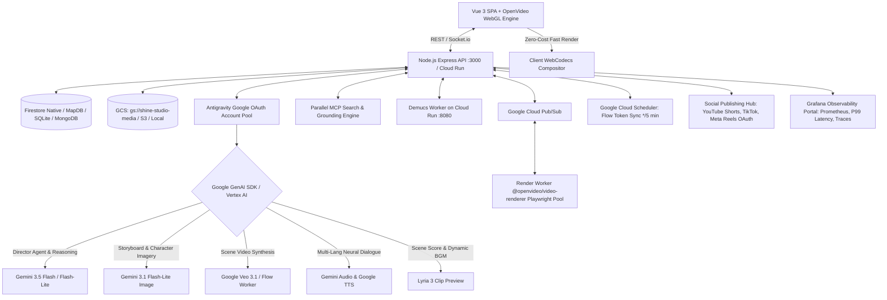
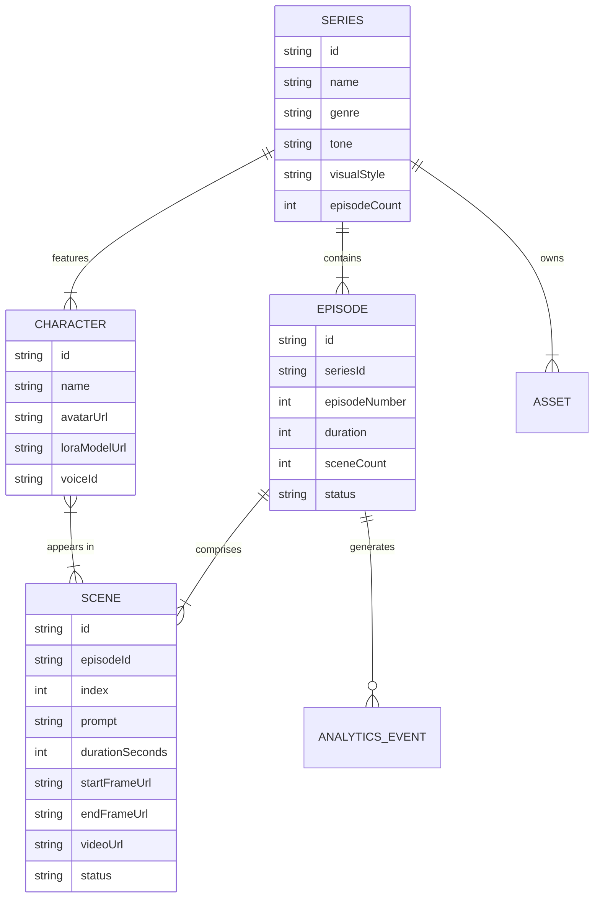
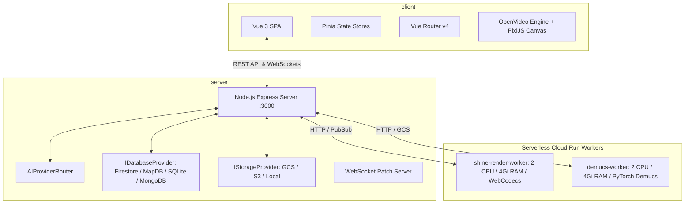
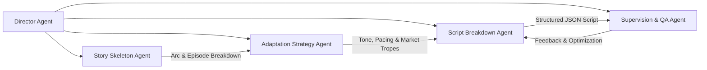
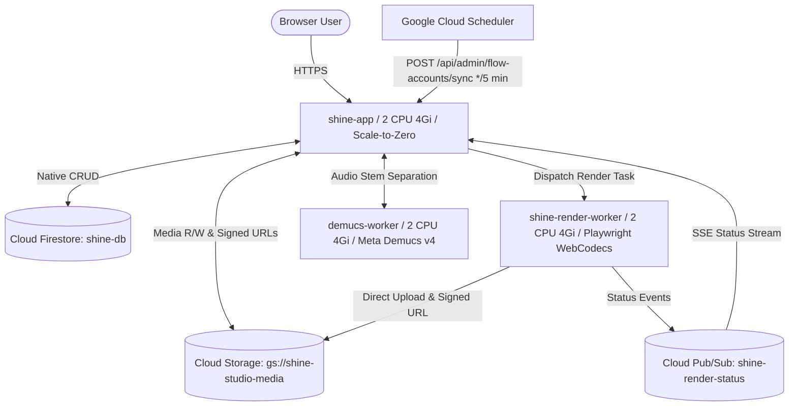

# Architecture Document: Shine - AI Micro-Drama Video Studio

## 1. System Overview

Shine is an enterprise-grade AI-powered platform tailored for creating serialized vertical short dramas (9:16 aspect ratio, typically 20–50 episodes of 1–3 minutes each). The platform integrates a Vue 3 SPA frontend, a modular Node.js (Express) backend, and utilizes Google Cloud GenAI & Vertex AI for all generative tasks via the official `@google/genai` SDK. By orchestrating a multi-agent AI director pipeline and a specialized multi-modal generation pipeline (Video, Audio, Image, Text), Shine enables end-to-end creation, character consistency management, episode editing, and social platform distribution.



---

## 2. Content Model

The core hierarchy of Shine maps directly to the serialized short drama format:



---

## 3. Modular Decoupled Workspace Architecture

The system is organized into a clean monorepo separating Frontend, Backend Server, and Serverless Worker Services:

- **Frontend Client:** [`apps/shine/client`](../client) — Vue 3 + Vite + TypeScript + Element Plus + TailwindCSS + OpenVideo Canvas Editor.
- **Backend API Server:** [`apps/shine/server`](../server) — Express Node.js Server, AI Provider Router, WebSocket server & Pluggable Database/Storage Abstractions.
- **Video Render Worker:** [`apps/shine/services/render-worker`](../services/render-worker) — Headless Playwright Chromium + PixiJS + WebCodecs hardware accelerated compositor container.
- **Demucs Audio Worker:** [`apps/shine/services/demucs-worker`](../services/demucs-worker) — PyTorch / Demucs v4 stem separator container for voice/BGM isolation.



---

## 4. Frontend Architecture (`apps/shine/client/`)

The frontend is a decoupled Vue 3 Single Page Application (SPA) built using Vite, TypeScript, Pinia, Axios, Element Plus (`element-plus`), TailwindCSS, and OpenVideo Canvas components.

### 4.1 Client Directory Structure
```
apps/shine/client/
├── public/                 # Static assets (favicons, images, sample media)
├── src/
│   ├── api/                # Centralized API service modules (auth.ts, series.ts, ai.ts, dubbing.ts)
│   ├── assets/             # Global CSS, Tailwind base, icons, brand assets
│   ├── components/         # Reusable UI & domain components
│   │   ├── basic/          # UI primitives (Buttons, Inputs, Cards, Dialogs)
│   │   ├── layout/         # Layout components (Header, Sidebar, UserMenu)
│   │   ├── editor/         # Timeline tracks, clip inspectors, preview players
│   │   └── business/       # Domain components (SeriesCard, ScriptItem, PersonaCard)
│   ├── composables/        # Shared Vue 3 composition hooks (useTheme, usePlayer, useTimeline)
│   ├── layouts/            # Layout shells (DefaultLayout, AuthLayout, AppLayout, StudioLayout)
│   ├── router/             # Vue Router route definitions & navigation guards
│   ├── stores/             # Centralized Pinia Stores (authStore, seriesStore, timelineStore)
│   ├── types/              # TypeScript API contract definitions & DTOs
│   ├── utils/              # Helper utilities & Centralized Axios Client (http.ts)
│   ├── views/              # Page View Components (Dashboard, Studio, Script, Dubbing, Export)
│   ├── App.vue             # Root component with dynamic layout resolver
│   └── main.ts             # Application entrypoint
├── index.html              # HTML entrypoint
├── package.json            # Client workspace dependencies
├── tailwind.config.js      # TailwindCSS configuration
├── tsconfig.json           # TypeScript configuration
└── vite.config.ts          # Vite build & alias configuration
```

### 4.2 Store-Driven Data Fetching & Centralized Axios Client
- **Store-Driven Architecture:** All user actions triggering network requests call Pinia store actions (e.g. `seriesStore.generateEpisode()`, `authStore.login()`). Views do not invoke raw endpoints directly.
- **Centralized Axios Client (`src/utils/http.ts`):** 
  - Automatically injects JWT Bearer token (`Authorization: Bearer <token>`) from persistent storage.
  - Automatically handles response unwrapping, toast error alerts, and redirects on 401 Unauthorized.

---

## 5. Backend Architecture (`apps/shine/server/`)

The backend is a decoupled Node.js Express service running inside [`apps/shine/server`](../server) designed as a resilient orchestrator for AI generation tasks, database operations, and worker coordination.

### 5.1 Server Directory Structure
```
apps/shine/server/
├── data/                   # Embedded SQLite (shine.db) & MapDB (mapdb.json) storage
├── src/
│   ├── agents/             # AI Pipeline Agents (DirectorAgent, ScriptAgent, PipelineTools)
│   ├── database/           # IDatabaseProvider interface & adapters (Firestore, MapDB, SQLite, MongoDB)
│   ├── integrations/       # Cloud & AI Integrations (GeminiClient, FlowAdapter, StorageFactory)
│   ├── middleware/         # Express middleware (auth, rbac, errorHandler)
│   ├── routes/             # REST API routes (series.ts, audio.ts, captions.ts, render.ts, admin.ts)
│   ├── services/           # Core business services (TimelineService, VideoService, CaptionService, CompositorWorker)
│   ├── storage/            # IStorageProvider interface & adapters (GcsStorage, S3Storage, LocalStorage)
│   ├── types/              # Server-side TypeScript interfaces & DTO schemas
│   ├── utils/              # Helper utilities, Logger, SkillLoader, PromptLoader
│   ├── app.ts              # Express application configuration & middleware setup
│   └── index.ts            # Server entrypoint (HTTP listener & port binding)
├── package.json            # Server dependencies
└── tsconfig.json           # Server TypeScript configuration
```

### 5.2 Standardized API Response Schema
All REST API endpoints return a standardized `ApiResponse<T>` envelope:
```json
{
  "code": 200,
  "data": { ... },
  "message": "Operation completed successfully",
  "error": null
}
```

---

## 6. AI Multi-Agent & Multimodal Pipeline

Shine orchestrates a multi-agent AI pipeline powered by the **Google GenAI SDK (`@google/genai`)**:



### 6.1 Google Cloud GenAI Modality Mapping
| Capability | Model / Engine | Method | Description |
| :--- | :--- | :--- | :--- |
| **Story & Reasoning** | Gemini 3.x / Flash | `generateContent()` | Autonomous scriptwriting, scene breakdown, emotional pacing. |
| **Storyboard & Cast** | Gemini Image Models / Nano Banana | `generateImage()` | Character avatars, consistent keyframes, 9:16 background concepts. |
| **Scene Video Synthesis** | Google Veo 3.x / Flow API | `generateVideos()` | Generates 4–8s visual motion clips from start/end keyframes. |
| **Neural Voiceover** | Gemini TTS / Google TTS | `synthesizeSpeech()` | Multi-speaker dialogue per language track with emotional inflection. |
| **Background Music** | Lyria 3 / Music FX | `generateMusic()` | Mood-adaptive soundtrack matching scene narrative tone. |
| **Stem Separation** | Demucs v4 Worker | `POST /separate` | Splits uploaded audio into vocals, drums, bass, and other instruments. |

---

## 7. Pipeline Workflow (B1 – B9)

The end-to-end drama production workflow follows 9 automated stages:

```
[B1: Storyboards] ➔ [B2: Characters/Assets] ➔ [B3: Image2Video] ➔ [B4: Multi-Lang Voiceover]
       ➔ [B5: Kinetic Captions] ➔ [B6: WebGL Preview]
              ➔ [B7: Dual Export] ➔ [B8: Auto-Save] ➔ [B9: Multi-Publish]
```

1. **B1: Storyboard Backgrounds** — Generates initial 9:16 scene visual concepts from script prompts.
2. **B2: Consistent Cast & Assets** — Generates and locks character avatars, facial reference anchors, and visual assets.
3. **B3: Scene Image-to-Video** — Converts storyboard scenes into motion video clips using Google Veo / Flow APIs.
4. **B4: Multi-Lang Neural Voiceover (TTS)** — Synthesizes multi-speaker dialogue per language track on dedicated audio tracks.
5. **B5: Kinetic Captions** — Generates word-level animated subtitles with translation and timing synchronization.
6. **B6: Interactive Timeline Preview** — Synchronizes all visual, audio, and subtitle assets in the OpenVideo canvas editor.
7. **B7: Dual-Mode Export** — Fast local browser render or high-performance serverless Cloud Run render worker.
8. **B8: Auto-Save & State Sync** — Automatically persists timeline state, scenes, and language tracks to Firestore / database.
9. **B9: Multi-Platform Publish** — Packages and exports video formats tailored for TikTok, YouTube Shorts, and Instagram Reels.

---

## 8. Decoupled Audio/Video Architecture for Global Dubbing

> [!IMPORTANT]
> **Decoupled Track Design:**
> Video clips generated by Google Veo are **purely visual (silent MP4 clips)** placed on the `VIDEO 1` track. Speech, dialogue, and voiceovers are generated **completely separately on dedicated audio tracks (`AUDIO 1`) using Neural TTS**. This decoupling allows creators to instantly switch languages for multi-market dubbing (English, Vietnamese, Spanish, Chinese, French) by swapping the TTS audio file on `AUDIO 1` and auto-realigning scene timing ($\Delta t_{\mu s}$) without re-rendering expensive video clips!

---

## 9. Data Storage & Pluggable Persistence Layer

Shine implements a clean provider abstraction pattern for both Databases and Object Storage:

### 9.1 Pluggable Database Providers (`DB_PROVIDER`)
- **Firestore Native (`firestore`) [Primary Cloud DB]:** Google Cloud Firestore database (`shine-db`) storing Series, Episodes, Scenes, Timelines, User Auth, and Flow Accounts with composite indexes.
- **MapDB (`mapdb`) [In-Memory / Fast Test]:** JSON-backed in-memory database (`data/mapdb.json`) for instant zero-dependency testing.
- **SQLite (`sqlite`) [Local DB]:** Local file-based database (`data/shine.db`) via `better-sqlite3`.
- **MongoDB (`mongodb`):** MongoDB Atlas support for document-oriented deployments.

### 9.2 Pluggable Object Storage Providers (`STORAGE_PROVIDER`)
- **Google Cloud Storage (`gcs`) [Primary Cloud Storage]:** Bucket `gs://shine-studio-media` with direct V4 Signed URLs (30-min read expiration via `roles/iam.serviceAccountTokenCreator`) and fallback direct streaming on `/download/:jobId`.
- **AWS S3 / S3-Compatible (`s3`):** Supports AWS S3, Cloudflare R2, and Backblaze B2.
- **Local Storage (`local`):** Local filesystem media hosting for offline development.

---

## 10. Serverless Google Cloud Run Ecosystem

The production infrastructure runs 100% serverless on Google Cloud Run (`us-central1`):



### 10.1 Service Sizing & Autoscaling Specifications
| Component | Cloud Service | Region | Specs (Default) | Scaling & Quota Protection |
| :--- | :--- | :--- | :--- | :--- |
| **Main App (`shine-app`)** | Cloud Run | `us-central1` | 2 CPU, 4Gi RAM, Timeout: 300s | `--min-instances 0`, `--max-instances 3`. $0 idle cost. |
| **Render Worker (`shine-render-worker`)** | Cloud Run | `us-central1` | 2 CPU, 4Gi RAM, Timeout: 600s | `--min-instances 0`, `--max-instances 5`, `--concurrency 10`. Managed **`VideoRendererPool`** (1–100 instances based on RAM/CPU, max 4 parallel instances per 4Gi container). |
| **Demucs Worker (`demucs-worker`)** | Cloud Run | `us-central1` | 1 CPU, 2Gi RAM, Timeout: 300s | `--min-instances 0`, `--max-instances 3`. PyTorch Demucs v4 stem isolation. |
| **Token Sync Heartbeat** | Cloud Scheduler | `us-central1` | `*/5 * * * *` | Calls `POST /api/admin/flow-accounts/sync` to refresh Google Flow session tokens. |
| **Primary Database** | Firestore Native | `us-central1` | Multi-region HA | Database ID: `shine-db`. Auto-deployed composite indexes. |
| **Media Storage** | Cloud Storage | `us-central1` | Standard Storage Class | Bucket: `gs://shine-studio-media` with Uniform Bucket Access & V4 Signed URLs. |

---

## 11. Deployment Automation & CLI Tooling

The deployment scripts support granular control to minimize build times and optimize resource allocations:

### 11.1 Deployment Commands
| Command | Execution Time | Scope & Purpose |
| :--- | :---: | :--- |
| **`pnpm run deploy:app`** | **~1–2 mins** | Deploys Main App only (`-SkipWorkers -SkipInfra`), dynamically reusing active worker URLs on Cloud Run. |
| **`pnpm run deploy:cloudrun`** | **~3–5 mins** | Full ecosystem deployment (GCP APIs + IAM + Infra + Demucs Worker + Render Worker + Main App + Scheduler). |
| **`pnpm run deploy:render-worker`** | **~1–2 mins** | Standalone Video Render Worker deployment with auto-provisioned IAM roles and `VideoRendererPool` settings. |
| **`pnpm run deploy:demucs-worker`** | **~1–2 mins** | Standalone Demucs AI Audio Worker deployment with auto-provisioned IAM roles. |

### 11.2 Environment & Autoscaling Configuration (`.env`)
```env
# Selective Deployment Flags
DEPLOY_WORKERS="true"
DEPLOY_INFRA="true"

# Render Worker: 2 CPU / 4Gi RAM with Instance Pool (1-100 instances based on RAM/CPU)
RENDER_WORKER_CPU="2"
RENDER_WORKER_MEMORY="4Gi"
RENDER_WORKER_TIMEOUT="600"
RENDER_WORKER_MIN_INSTANCES="0"
RENDER_WORKER_MAX_INSTANCES="5"
RENDER_WORKER_CONCURRENCY="10"
RENDER_POOL_SIZE="4"
RENDER_POOL_MIN="1"
RENDER_MAX_PER_INSTANCE="25"

# Demucs Worker Resources
DEMUCS_WORKER_CPU="1"
DEMUCS_WORKER_MEMORY="2Gi"
DEMUCS_WORKER_TIMEOUT="300"
DEMUCS_WORKER_MIN_INSTANCES="0"
DEMUCS_WORKER_MAX_INSTANCES="3"

# Main App Resources
APP_CPU="2"
APP_MEMORY="4Gi"
APP_TIMEOUT="300"
APP_MIN_INSTANCES="0"
APP_MAX_INSTANCES="3"
```

---

## 12. Enterprise Subsystems & Extensions

### 12.1 Antigravity Google OAuth Account Pool & High-Throughput Token Router
- **Multi-Account Session Pooling:** Maintains an active pool of authenticated Google OAuth accounts (`AccountPool`) for high-speed Gemini 3.5 text inference, JSON extraction, and Veo video synthesis.
- **Round-Robin & Health Heartbeat:** Automatic health check monitoring, token expiration refresh, and graceful fallback on 429 quota exhaustion to ensure 99.9% uptime during batch episode rendering.
- **Fine-Grained Credit Deduction Accounting:** Built-in task credit consumption tracker mapping credit burns per pipeline phase (Story Plan: 15, LoRA Anchor: 10, Scene Image: 15, Veo Video: 50, Voice Synthesis: 10, Server Render: 30).

### 12.2 Parallel MCP Web Grounding & Regulatory Intelligence
- **Live Search MCP Integration:** Connects with Parallel Search MCP (`https://search.parallel.ai/mcp`) for real-time market research and viral drama trend discovery across global regions (US, Vietnam, China, Japan).
- **Pre-Production Regulatory Scanner:** Multi-modal compliance verification scanning for Violence/Gore, Adult Content, Cultural Sensitivity, and Copyright/IP similarity against commercial distribution redlines.
- **Grounding Citations:** Embeds verifiable web citations directly into series master plans to ensure originality and protect against infringement.

### 12.3 Social Publishing Hub (Direct OAuth Multi-Channel Distribution)
- **Multi-Platform OAuth Integrations:** Direct API publishing connectors for **YouTube Shorts** (`Google Cloud OAuth`), **TikTok for Creators** (`TikTok Open API`), and **Meta Reels** (`Facebook Graph API`).
- **3-Step Publishing Pipeline:** Video version selection, AI social optimizer (viral titles, emojis, hashtags, and keyframe/AI poster generation), and 1-click immediate or scheduled deployment.
- **Live Stream Upload Verification:** Confirmed end-to-end streaming deployment to YouTube Shorts with live player playback verification.

### 12.4 Grafana Observability Portal & Telemetry Stream
- **Real-Time Prometheus Metrics:** Live tracking of system health including P99 API Latency (142ms, SLA <250ms), Memory Usage (RSS / Heap), AI Inference Time (1.82s avg), and API 5XX Error Rate (0.04%).
- **Subagent Distributed Traces:** End-to-end trace logging per autonomous agent and background Cloud Run worker execution (`tr_YFYX9bu9`) streamed to Grafana Cloud.
- **Worker Microservice Telemetry:** Pub/Sub worker heartbeat monitor, active jobs counter, and queue depth analytics.

### 12.5 Sets, Locations & Narrative Props Continuity Engine
- **Virtual Sets Repository:** Persistent environment definitions (e.g. Vance Manor Private Study, Corporate Boardrooms) tagged by lighting (Day/Night) and architectural style.
- **Key Narrative Props:** Tracking critical plot items (e.g. Encrypted USB Drive, Platinum Signet Ring) across multiple scenes and episodes to eliminate visual hallucination and preserve dramatic continuity.
